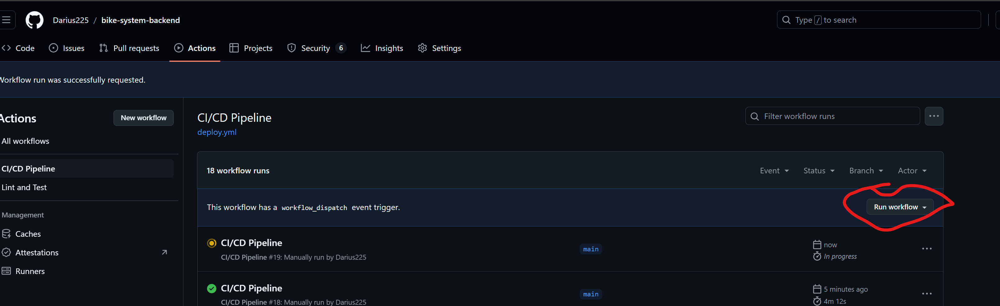
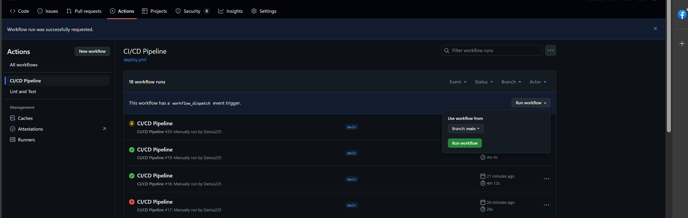
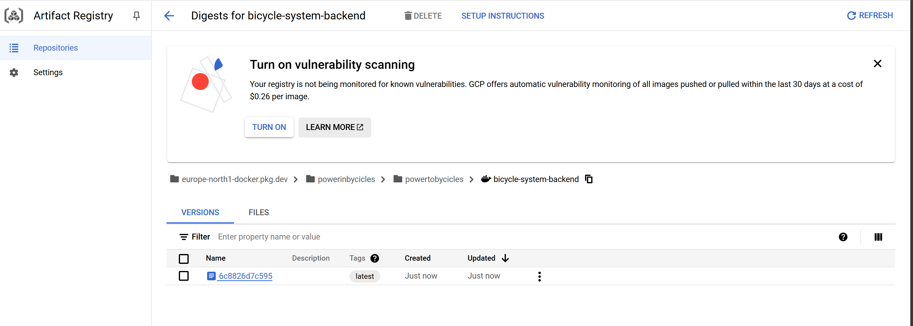

# Bike Station Service

> **Backend API service** that aggregates real-time bike-sharing data from multiple providers via the [GBFS specification](https://github.com/MobilityData/gbfs/blob/master/gbfs.md). Built with **NestJS**, **TypeScript**, and containerized for **Google Cloud Run**.

## Key Engineering Decisions

| Area | Decision | Rationale |
|---|---|---|
| **Framework** | NestJS | Modular architecture, built-in DI, interceptor pipeline for response validation |
| **External data** | GBFS standard | Vendor-neutral contract — adding a new city is a config change, not a code change |
| **Validation** | DTO + class-validator interceptors | Upstream APIs are untrusted; every response is validated before reaching consumers |
| **Testing strategy** | Unit tests (mocked) + E2E tests (live GBFS endpoints) | Unit tests run on every push via CI; E2E tests gate deployment and run against real data |
| **Deployment** | Docker → Google Cloud Run via GitHub Actions | Manual-trigger deployment; E2E must pass before deploy proceeds |

### Production Considerations & Known Limitations

- **Rate limiting:** E2E tests include a configurable delay between requests to avoid overwhelming upstream GBFS endpoints.
- **Artifact registry authentication:** Currently uses basic push credentials. A production hardening step would be to configure Workload Identity Federation to eliminate long-lived service account keys.
- **Error handling:** Upstream fetch failures return empty arrays for collection endpoints and throw typed exceptions for single-object lookups, preventing partial data from propagating silently.

---

## Table of Contents

- [API Endpoints](#api-endpoints)
- [Project Structure](#project-structure)
- [Testing](#testing)
- [Running Locally](#running-locally)
- [Docker](#docker)
- [CI/CD Pipeline](#cicd-pipeline)
## API Endpoints

| Method | Endpoint | Description |
|---|---|---|
| `GET` | `/bike-stations/:location/stations` | List all stations for a location (`oslo`, `bergen`, `milan`) |
| `GET` | `/bike-stations/:location/station-status/:stationId` | Station availability by ID |
| `GET` | `/bike-stations/:location/system-info` | System metadata for a location |

All endpoints return **JSON**. Unknown locations return `404`.

## Project Structure

```
src/
├── app.module.ts
├── main.ts
├── api/                          # Generic HTTP client wrapper
│   ├── api.service.ts
│   └── api.module.ts
├── config/
│   └── config.module.ts
├── bike-stations/
│   ├── bike-stations.controller.ts
│   ├── bike-stations.service.ts
│   ├── dto/                      # Validated against GBFS spec
│   │   ├── station-info.dto.ts
│   │   ├── station-status.dto.ts
│   │   └── system-info.dto.ts
│   └── types/
│       └── bike-stations-response.types.ts
└── common/
    └── interceptors/             # Response validation pipeline
        ├── array-of-objects-response-validator.interceptor.ts
        └── single-object-response-validator.interceptor.ts

tests/
├── bike-stations/                # Unit tests (controller, service, DTOs)
├── common/interceptors/          # Interceptor unit tests
└── bicycle-backend-system.e2e-test.ts
```

## Testing

| Command | Scope | Description |
|---|---|---|
| `npm run test:unit` | Unit | Controller, service, DTO validation, interceptors |
| `npm run test:e2e` | E2E | Full request cycle against live GBFS endpoints |

## Running Locally

```bash
npm install
npm run start:dev
```

### Environment Variables

| Variable | Example | Description |
|---|---|---|
| `GBFS_SERVICE_BASE_URL` | `https://gbfs.urbansharing.com/` | Base URL for the GBFS federation |

## Docker

```bash
docker build -t bicycle-system:latest .
docker run -p 3000:3000 -e GBFS_SERVICE_BASE_URL=https://gbfs.urbansharing.com/ bicycle-system:latest
```

## CI/CD Pipeline

Two GitHub Actions workflows:

| Workflow | Trigger | Steps |
|---|---|---|
| **Lint & Test** (`short-ci.yml`) | Push / PR to `main` | Checkout → Install → Lint → Unit tests |
| **Deploy** (`deploy.yml`) | Manual (`workflow_dispatch`) | E2E tests → Docker build → Push to GCR → Deploy to Cloud Run |

Deployment requires E2E tests to pass first. This prevents deploying code that compiles but breaks against real upstream data.

<details>
<summary>Pipeline screenshots</summary>





</details>

## Linting

ESLint with TypeScript rules (ES2020 target) and Prettier for formatting.

```bash
npm run lint            # Check
npx eslint . --fix      # Auto-fix
```
